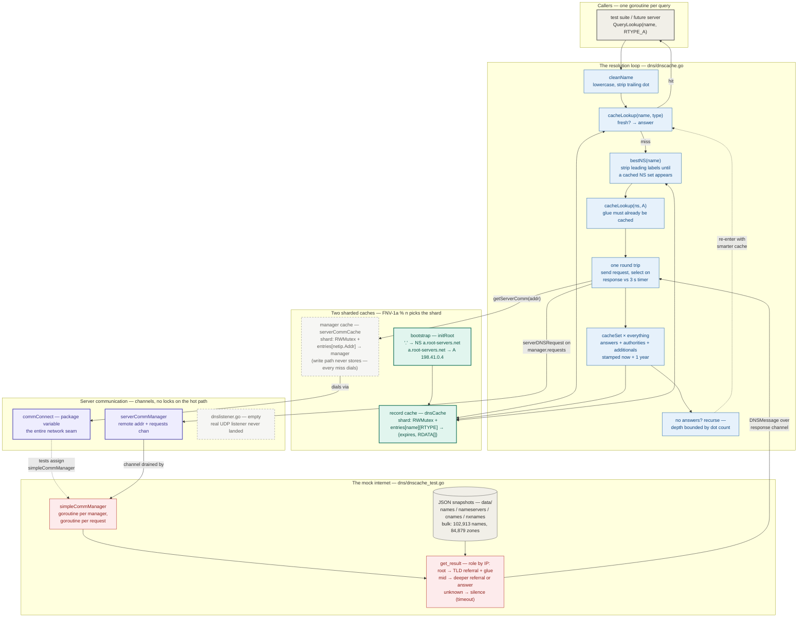
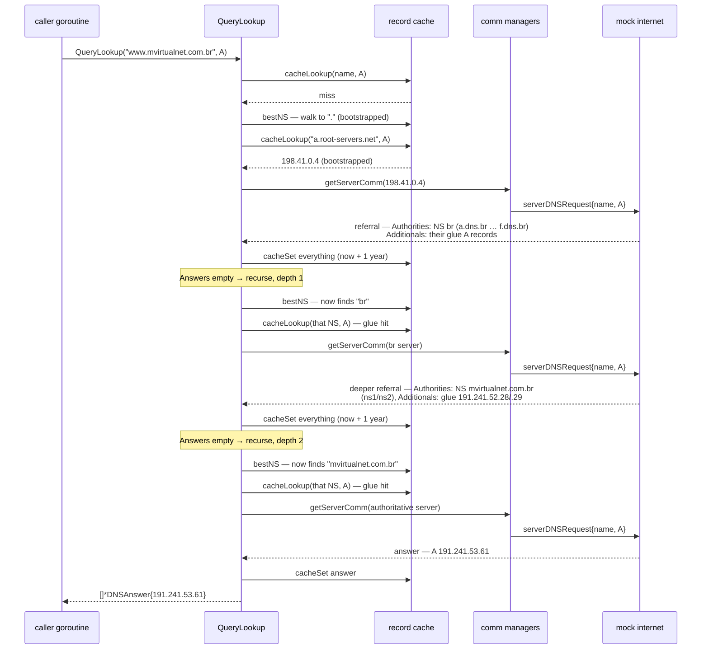

# DNS Resolver — system design

> How a name becomes an address, one cached fact at a time.
>
> A query enters `QueryLookup` knowing only one thing: the address of a root
> server, planted at startup. Each round of the loop asks the **most specific
> nameserver the cache already knows**, and every record the server volunteers —
> answers, authority NS records, glue addresses — is thrown into a **hash-sharded,
> RWMutex-guarded cache**. Then the loop simply asks itself again: the cache is
> now one delegation deeper, so the next round starts closer to the answer.
> Recursion is bounded by the number of labels in the name; the network is a
> single swappable function variable, replaced in tests by a **mock internet**
> of a hundred thousand records that answers over channels.

This document is the developer-facing map of the whole system — every component
and how data moves between them. The companion [README](README.md) covers the
per-layer detail, building, and running.

---

## End-to-end flowchart



**Legend** — ⬜ callers / data · 🟦 resolution loop · 🟩 record cache ·
🟪 server communication · 🟥 mock internet (test-only) ·
◌ dashed = present but unwired (the manager-cache store, the listener).

---

## How to read it: the three ideas that matter

1. **The cache is the resolver's entire world-model.** There is no resolution
   tree, no pending-query table, no per-query state beyond a depth counter.
   `QueryLookup` interleaves two moves — *"what's the most specific NS I
   already know?"* (`bestNS` strips leading labels one at a time, from the
   full name down toward the bootstrapped root) and *one network round trip* — and between them dumps
   every volunteered record into the cache. Referral NS records land where
   `bestNS` looks; glue A records land where the address check looks. The
   recursion doesn't carry knowledge forward, it just re-runs the same
   question against a cache that got smarter — which also means every
   concurrent query sharing a suffix inherits the progress for free.

2. **Sharding makes the cache safe to hammer, cheaply.** Both caches (records
   and server managers) are slices of independent shards, each a plain Go map
   behind its own `RWMutex`; FNV-1a of the key modulo the shard count picks
   one. Readers of a warm shard share the lock; writers exclude only their own
   shard. There is no global lock anywhere, and correctness never depends on
   *which* concurrent writer wins — competing `cacheSet`s race one-record
   slices for the same key, and any surviving record is a valid next hop. The
   tests hammer the manager cache at 1 and 1024 shards and the bulk-lookup
   stress at 1024 and again at 32: the 1-shard case is the adversarial
   configuration where every operation collides on one lock and latent race
   bugs have nowhere to hide.

3. **The network is a variable.** The only way out of the process is
   `commConnect`, a package-level `func(*netip.Addr) *serverCommManager`.
   Production would dial UDP; the tests assign `simpleCommManager`, which
   fabricates a nameserver per IP out of JSON snapshots and serves it over
   channels — goroutine per server, goroutine per request. Unresolvable names
   are answered with *silence* — the mock's way of simulating a dead server,
   leaving the resolver's 3-second timer as the only defense. (No test
   actually queries such a name; if one did, the timeout path would panic —
   see the sharp edges.) The resolver cannot tell a mock from a socket, which
   is the point.

---

## Deep dive 1 — one cold lookup, end to end

`TestBasic` resolves `www.mvirtualnet.com.br` against the 50-lookups snapshot,
starting from a cache that knows only the root — three round trips:



Things worth noticing:

- **The referral shape is load-bearing.** The mock's `create_ns` puts NS
  records in *Authorities* and glue addresses in *Additionals* — the same
  split real DNS uses — and the resolver's cache-everything step is what
  converts that shape into progress. Drop the glue from the cache and step 2
  of the next round dead-ends.
- **The depth bound is the dot count.** `www.mvirtualnet.com.br` has three
  dots, so at most four rounds (depths 0–3) can run — matching the deepest
  possible delegation chain for a name of that shape; this trace used three
  of them. A referral loop between misbehaving servers burns depth each
  round and terminates with `nil`.
- **A second lookup of anything under `.br` now starts at least one level
  deeper** — the `br` and `mvirtualnet.com.br` delegations are cached
  process-wide, not per query.

## Deep dive 2 — anatomy of a shard

```text
        dnsCache  ────────────  []*dnsCacheUnit, length n (InitCache)
            │
            │   shard = FNV-1a(lowercase name) % n
            ▼
        ┌─────────────────────────────────────────────┐
        │  dnsCacheUnit                               │
        │  lock  sync.RWMutex ── readers share,       │
        │                        writers exclude      │
        │  entries                                    │
        │    "www.example.com" ─► RTYPE_A  ─► entry   │
        │    "example.com"     ─► RTYPE_NS ─► entry   │
        │    "com"             ─► RTYPE_NS ─► entry   │
        │                                             │
        │  entry = { expires time.Time                │
        │            data    []RDATA }                │
        └─────────────────────────────────────────────┘
```

- **Keys are canonical**: `cleanName` lowercases and strips the trailing dot
  (`""` becomes `"."`, the root), and both `cacheLookup` and `cacheSet` clean
  before hashing — so `www.Example.COM.` and `www.example.com` are one entry.
- **Expiry is lazy**: `cacheLookup` returns `nil` for a stale entry but never
  deletes it; there is no eviction of any kind. With everything stamped
  one year out, the cache is effectively append-only for a process lifetime.
- **The maps are born lazily**: a shard starts with a `nil` map; the first
  `cacheSet` on it allocates both levels under the write lock.
- **The hash seed is inert**: FNV-1a is *supposed* to be salted with
  `crypto/rand` bytes per run to prevent adversarial shard-hotspot attacks,
  but the seed slice is nil, so `rand.Read` fills zero bytes and placement is
  deterministic. The defense is one `make([]byte, 16)` away.

The manager cache (`serverCommCache`) mirrors this layout — shards, RWMutex,
one-level `map[netip.Addr]*serverCommManager` — but its write path is
unfinished: `establishServerComm` locks, dials, and returns without either
re-checking or storing, so every miss creates a fresh manager and goroutine.
The harness's duplicate-manager detector would catch this, except it never
records managers either. Two unwired safety nets, canceling out.

---

## Component inventory

| Component | Layer | Provenance | Where |
|---|---|---|---|
| Message model — enums, `RDATA` union, `DNSMessage` | Types | course scaffolding | [dnsmsg.go](dns/dnsmsg.go) |
| Cache shards, hashing, bootstrap (`InitCache`, `initRoot`) | Cache | course scaffolding | [dnscache.go](dns/dnscache.go) |
| `cacheLookup` / `cacheSet` / `cleanName` / `bestNS` | Cache | ✅ implemented here | [dnscache.go](dns/dnscache.go) |
| `QueryLookup` — the resolution loop | Resolver | ✅ implemented here | [dnscache.go](dns/dnscache.go) |
| `getServerComm` / `establishServerComm` | Comm | ✅ implemented (store unfinished) | [dnscache.go](dns/dnscache.go) |
| `commConnect` seam | Comm | course scaffolding | [dnscache.go](dns/dnscache.go) |
| Mock internet — managers, `get_result`, referral builders | Test harness | course scaffolding | [dnscache_test.go](dns/dnscache_test.go) |
| DNS snapshots (50-lookups, bulk) | Test data | course scaffolding | [data/](data/) |
| Network listener | — | ⬜ placeholder only | [dnslistener.go](dns/dnslistener.go) |
| CLI driver | — | ⬜ stub (`InitCache` and exit) | [main.go](main.go) |

---

## The numbers that matter

| Value | What it is |
|---|---|
| 2 | levels in the record cache map: name → RTYPE → entry |
| 32-bit FNV-1a | shard hash for both caches; shard = hash % n |
| 3 s | per-round-trip server timeout in `QueryLookup` |
| 1 | buffer slot on each response channel — a late reply never blocks the mock |
| 1 year | TTL stamped on the bootstrap and on every cached record |
| 198.41.0.4 | `a.root-servers.net` — the single bootstrapped root, all cold lookups start here |
| dots in the name | recursion depth bound (`depth > strings.Count(name, ".")` → give up) |
| 1 / 32 / 1024 | shard counts exercised by the tests (1 = maximum-contention adversarial case) |
| 4,097 | concurrent lookups per stress test (the `i > 4096` guard overshoots by one) |
| 200 + 1 | manager-cache hammer rounds: 50 × four shard/iteration combos, then one bulk round |
| 102,913 / 84,879 / 24,914 / 17,409 | A names / zones / CNAMEs / NXDOMAINs in bulk.json (~14 MB) |
| 0 | real packets sent — the network below `commConnect` is entirely mocked |

---

## Verification workflow

| Stage | Test | What it proves |
|---|---|---|
| 1 | `TestJSON`, `TestSOA_RECORD_String`, `TestNameHash` | a `DNSQuestion` decodes from JSON, `SOA_RECORD` formats correctly, hashing is stable and case-insensitive |
| 2 | `TestCommManager` | the mock hierarchy responds at every level when walked by hand (root referral, authoritative answer, TLD referral) — printed for inspection, no assertions |
| 3 | `TestBasic` | one cold recursive lookup end to end — `www.mvirtualnet.com.br` → `191.241.53.61` |
| 4 | `TestGetCommManager` | manager cache hammered 50 rounds × {1, 1024 shards} × {1, 100 goroutines per server}, then a bulk round — races have nowhere to hide |
| 5 | `TestCacheLookups` | bootstrapped records are served straight from the cache |
| 6 | `TestLotsLookups` / `TestLotsLookups2` | 4,097 concurrent lookups against the 85,000-zone bulk snapshot, at 1024 and again at 32 shards, 5 s per-lookup deadline |

The full suite runs in ~19 s (`go test ./dns -v`), dominated by the
`TestGetCommManager` hammer; the race detector passes on the lookup tests
(`go test ./dns -race -run 'TestBasic|TestCacheLookups|TestLotsLookups2'`).

---

## Design trade-offs & sharp edges

- **Cache-as-world-model over explicit resolution state** — radically simple
  and naturally shared across concurrent queries, but it means resolution
  correctness *depends* on caching policy: the loop only advances because
  referrals and glue are cached, and the address lookup in step 2 refuses to
  recurse — an NS without cached glue is a dead end rather than a sub-lookup.
- **Depth-by-dot-count over loop detection** — no cycle bookkeeping at all,
  at the cost of giving up early on delegation chains longer than the name is
  deep (rare in practice, impossible in the test data).
- **Last-writer-wins caching over entry merging** — `cacheSet` replaces the
  RDATA slice wholesale, and `QueryLookup` caches each referral record as its
  own one-element slice, so even a single referral's six NS records overwrite
  one another and the zone entry keeps only the last. Any surviving record is
  a valid next hop, which is why the workloads here never notice.
- **A 1-year uniform TTL over real TTL plumbing** — `DNSAnswer` has no TTL
  field, so the resolver invents one. Combined with lazy expiry and no
  eviction, the cache only ever grows; fine for a test-driven homework
  process, unbounded for a daemon.
- **The unfinished manager store** — every query dials a fresh manager
  (goroutine included), so the sharded manager cache currently provides
  sharding without caching. Correct behavior, but an unbounded leak — one
  manager and one permanent goroutine per round trip.
- **The timeout path is a trap** — a server that stays silent for 3 seconds
  leads straight to a nil-pointer panic on `msg.Answers`. The mock *does*
  simulate dead servers, but only for names the tests never query.
- **Determinism where randomness was intended** — the unseeded hash (see deep
  dive 2) removes the anti-hotspot defense but makes shard placement
  reproducible, which is arguably a debugging feature in a homework setting.

---

## Provenance

ECS 158 (Parallel Architectures, UC Davis) homework — module `ECS-158-HW1`.
Course scaffolding provided the type definitions, function signatures and doc
comments, the mock-internet test harness, and the JSON snapshots; the resolver
logic implemented on top of it is the cache (`cacheLookup`, `cacheSet`,
`cleanName`, `bestNS`), the resolution loop (`QueryLookup`), and the server-comm
lookup path (`getServerComm`, `establishServerComm`) in
[dnscache.go](dns/dnscache.go). The `// RICO discussion` comments mark ideas
worked out in discussion section.
